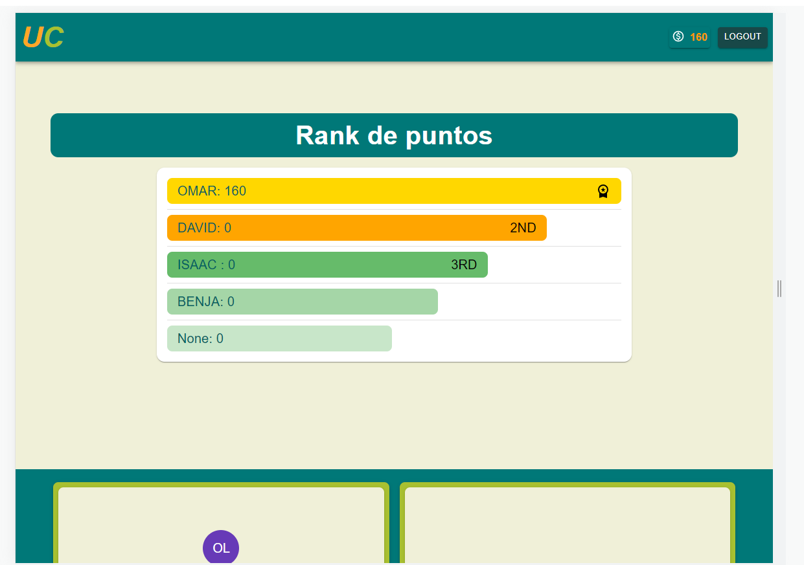
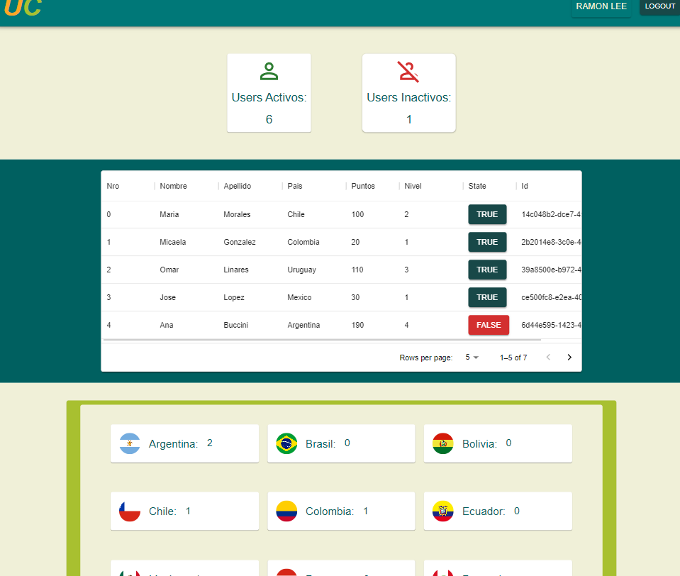

# UCulture

Es una app de seleccion simple, que cuenta con 4 niveles, el objetivo es sacar conseguir puntos y aparecer en el ranking

## Seccion del usuario

### Seccion de usuarios
- Cuenta con la seccion del usuarios con estadisticas del usuario y la seccion de las task

### Seccion admin
- La seccion admin puede verse todo los users, activos e inactivos, tambien el pais de procedencia

- Se puede ingresar con=> email: admint@google.com password: 09876532. Pero no se puede realizar cambios solo los puede hacer el SUPER

## Tecnologias usadas

- Javascript
- Typescript
- React
- Node
- Express
- Postgres
- Sequelize

### instalacion de paquetes

npm i
